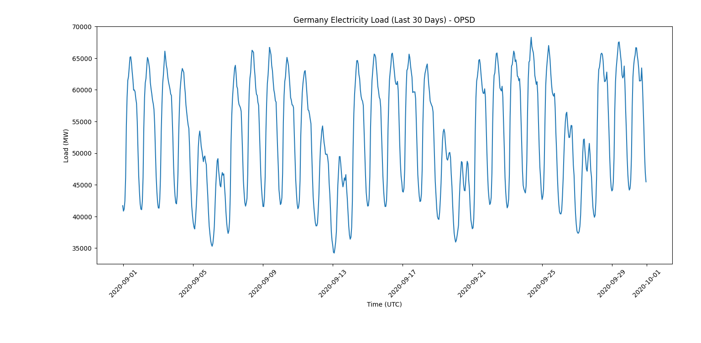
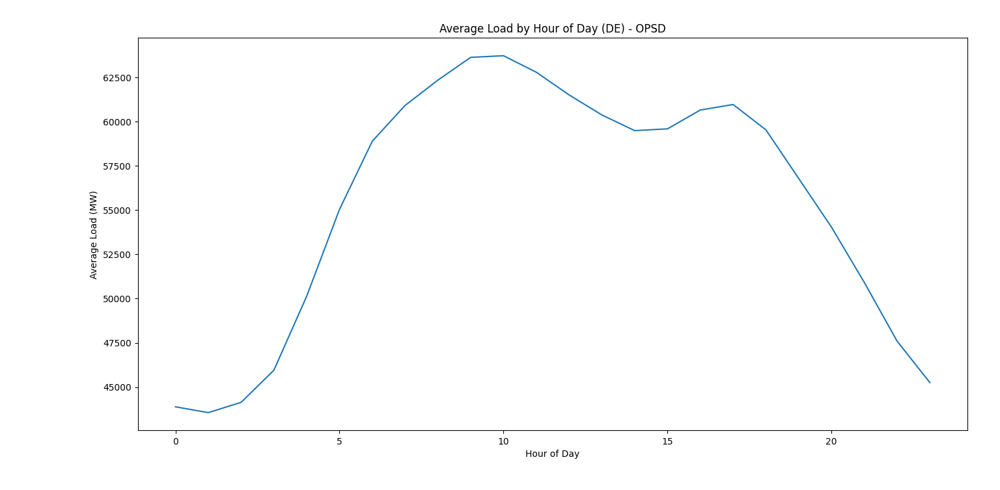
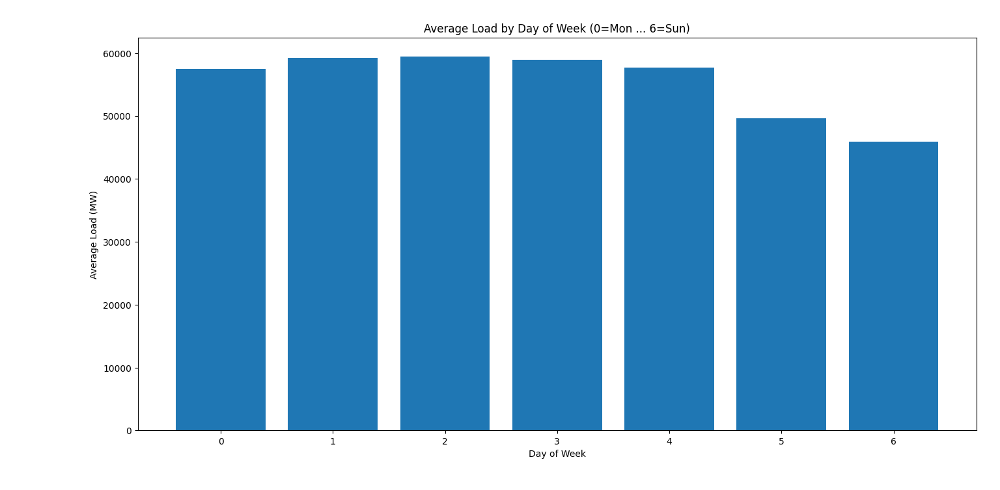

# Data Documentation – Germany Electricity Load (OPSD)

This document explains the data used in the **Germany Energy Load Forecast API**, including its source, structure, meaning, and exploratory data analysis (EDA).

---

## Data Source

- **Provider:** Open Power System Data (OPSD)
- **Dataset:** Time Series – Germany Actual Load
- **Link:** https://data.open-power-system-data.org/time_series/
- **Resolution:** Hourly
- **Unit:** Megawatts (MW)

The dataset represents the **total electricity demand of Germany**, aggregated at national level.

---

## Data Structure

The data is loaded dynamically and stored in a pandas DataFrame.

### Index
- **Type:** `DatetimeIndex`
- **Timezone:** UTC
- **Frequency:** Hourly

Each index value represents a specific hour in time.

### Columns

| Column Name | Description |
|-------------|-------------|
| `load_mw` | Total electricity demand in Germany (MW) |

**Example row:**
```text
2020-10-01 18:00:00+00:00 → 62,500 MW
```

**Meaning:**  
At 6 PM UTC on October 1st, Germany consumed approximately 62.5 GW of electricity.

---

## Basic Data Inspection

Key properties of the dataset:
- Continuous numerical time series
- No categorical variables
- Strong temporal dependencies
- Clear daily and weekly cycles

This makes the dataset well suited for time-series forecasting.

---

## Exploratory Data Analysis (EDA)

### 1️⃣ Electricity Load Over Time

This plot shows the electricity demand over the last 30 days.

**Insight:**
- Clear daily cycles
- Repeating consumption patterns
- Peaks during daytime and early evening

### 2️⃣ Average Load by Hour of Day

This visualization shows the average electricity demand for each hour of the day.


**Insight:**
- Lowest demand during night hours
- Morning and evening demand peaks
- Hour of day is a strong predictor for forecasting

### 3️⃣ Weekly Consumption Patterns

Electricity demand differs between weekdays and weekends due to industrial and commercial activity.


**Insight:**
- Lower demand on weekends
- Human behavior strongly influences load patterns

---

## Why This Data Matters

Understanding electricity load patterns is critical for:
- Power grid stability
- Energy generation planning
- Integration of renewable energy
- Preventing overproduction and blackouts

This dataset reflects real-world energy system behavior, not simulated or synthetic data.

---

## Relation to the Forecasting Model

The observed patterns directly motivate:
- Lag features (1h, 24h, 168h)
- Hour-of-day features
- Day-of-week features

The machine learning model learns these patterns directly from historical data.

---

# 📊 Interactive Data Dashboard (Streamlit)

To complement the FastAPI service and provide exploratory data analysis (EDA) in a more intuitive way, this project includes an interactive Streamlit dashboard.

---

## Why Streamlit?

Streamlit is a Python framework designed to quickly turn data analysis scripts into interactive web applications. In this project, Streamlit is used to:

- Explore the OPSD electricity load dataset visually
- Inspect dataset structure without using the terminal
- Present statistics and data previews in a professional UI
- Bridge the gap between data engineering, analysis, and stakeholder-friendly visualization

This approach is commonly used in:
- Energy analytics teams
- Data science prototyping
- Internal dashboards for engineers and analysts

---

## Dashboard Features

The dashboard provides:

### Dataset Overview
- Total number of rows and columns
- Time range (start & end timestamps)

### Interactive Data Preview
- Adjustable number of rows (head of the dataset)

### Dataset Metadata
- Column names
- Data types
- Index type (DateTimeIndex)

### Summary Statistics
- Mean, standard deviation, min/max, percentiles

---

## Dashboard Screenshot


*Interactive Streamlit dashboard showing real German electricity load data from OPSD.*

---

## How It Fits Into the Project Architecture

- **FastAPI** → production-ready API (forecasting, plots, health checks)
- **Streamlit** → exploratory analysis & visualization layer
- **Docker** → consistent runtime for both services

This separation reflects real-world industry setups where:
- APIs serve machines and systems
- Dashboards serve humans

---

## Running the Dashboard
```bash
streamlit run dashboard/app.py
```

The dashboard runs independently from the FastAPI service and is intended for analysis, validation, and presentation, not production inference.

---

## Access the Dashboard

Once running, open your browser at:
```
http://localhost:8501
```

---

## Benefits of This Approach

- **Separation of concerns:** API and dashboard serve different purposes
- **Flexibility:** Dashboard can be updated without affecting API
- **User-friendly:** Non-technical stakeholders can explore data
- **Development speed:** Rapid prototyping and iteration

## Summary

- Real national-level energy data
- Hourly time-series structure
- Strong temporal and behavioral patterns
- Direct relevance to energy digitalization and climate-tech
